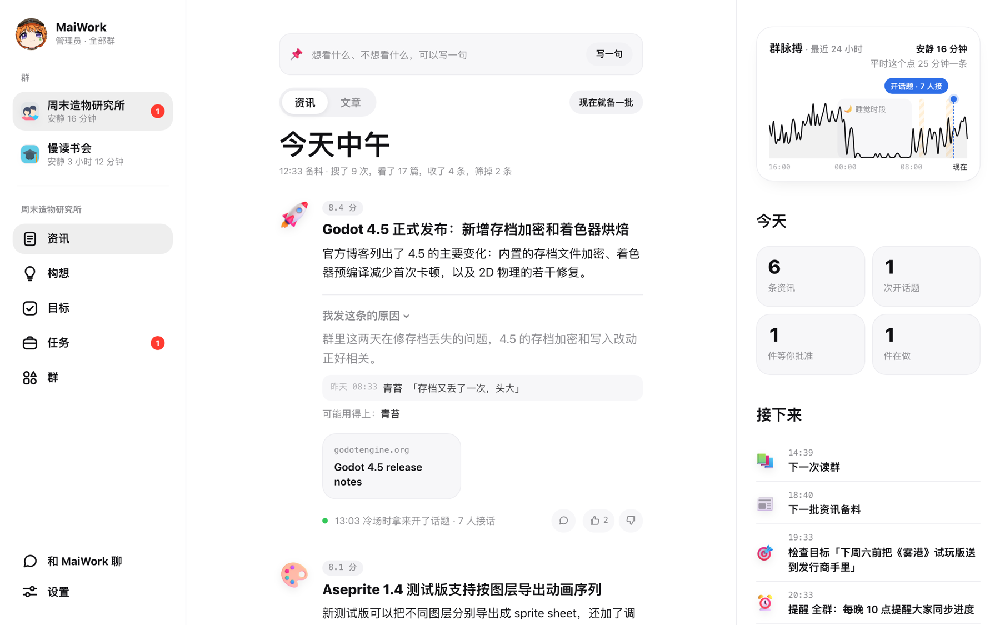
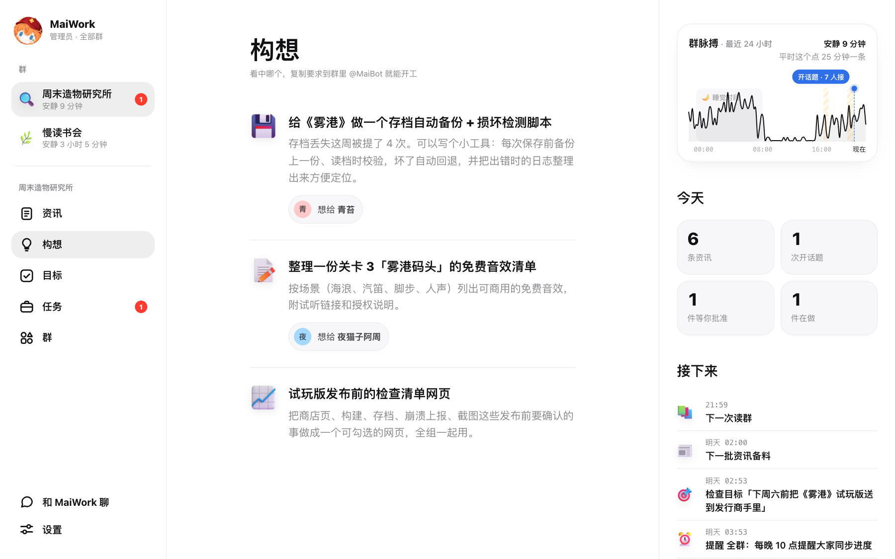
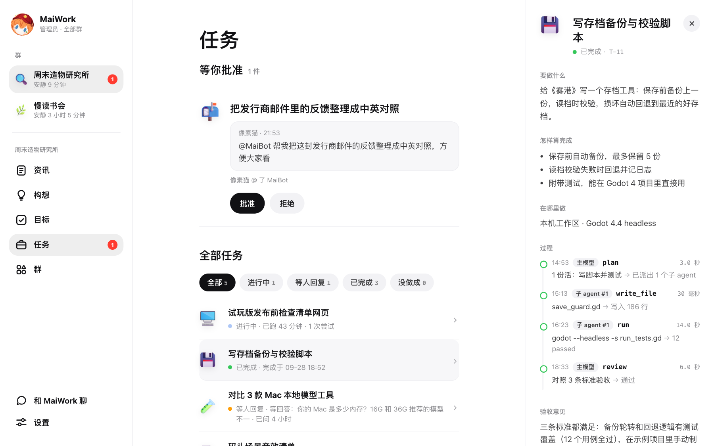
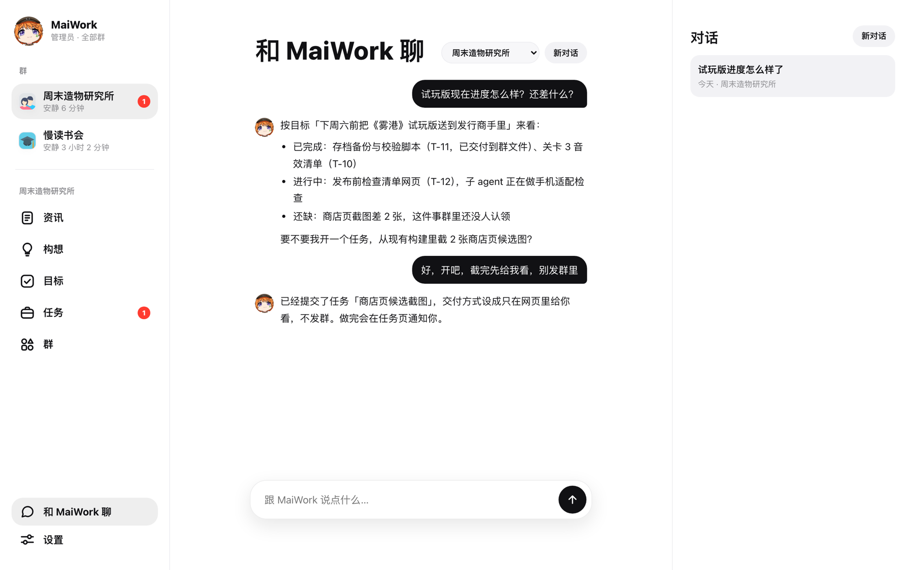
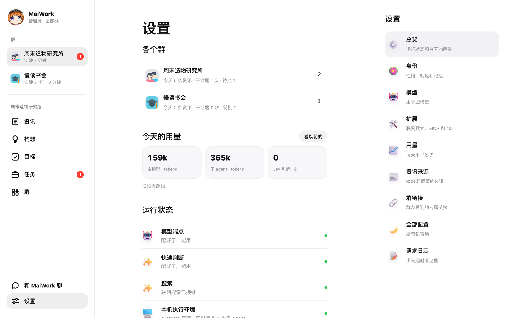

<div align="center">


# MaiWork

**MaiBot 的常驻生产力 Agent**：理解一个群 · 主动找资讯 · 提构想 · 追目标 · 交付任何工作

[](https://github.com/CharTyr/MaiWork)
[](https://github.com/Mai-with-u/MaiBot)
[](https://github.com/Mai-with-u/MaiBot)
[](LICENSE)
[](https://github.com/CharTyr/MaiWork/stargazers)
[](https://github.com/CharTyr/MaiWork/issues)

[核心特性](#核心特性) • [界面一览](#界面一览) • [运行环境](#运行环境) • [快速开始](#快速开始) • [指令](#指令) • [安全与隐私](#安全与隐私) • [常见问题](#常见问题) • [详细文档](#详细文档)

**在线看网页演示：[dewy-vow-gebh.here.now](https://dewy-vow-gebh.here.now/)**

</div>

> MaiWork 是 MaiBot 的插件（插件 ID `chartyr.maiwork`）。它和 MaiBot **并行运行**、共用一套人设，但**不抢 MaiBot 的话筒**：不改回复频率、不拦 MaiBot 说话。想让群里知道的事，优先交给 MaiBot 在聊天里顺口提。
>
> 基本功能已完成，仍在持续迭代。
>
> 当前版本 **0.9.3**。每一版改了什么、升级要注意什么，见[升级说明](docs/guide/upgrade.md)；升级前请备份插件和数据目录。

<div align="center">

</div>
<div align="center">

</div>

---

## 核心特性

| 特性 | 说明 |
|------|------|
| **主动资讯** | 每天几个时段，按群里在聊的话题上网找新消息和好文章；打分、去重、控制话题比例，只留值得看的 |
| **构想与目标** | 提「我可以帮你们做这个」的点子；长期的事立成目标，定期检查进度、自己往前推 |
| **接活交付** | 群友 @MaiBot 派活（查资料、做对比、写小网页、出 PDF…），子 agent 去做，主模型验收，不合格打回重做 |
| **不打扰** | 主动发到群里的消息每天有上限，睡觉时段不开话题，冷场时才开一句话题 |
| **管理员说了算** | 群友派的活默认要管理员批准；低风险小活可自动放行（可关） |
| **网页控制台** | 每个群一套资讯 / 构想 / 在做的事 / 群页面，管理员能直接和 MaiWork 对话；群页里还能写这个群的规矩、看它自己总结的做法；适配手机、平板、电脑 |


每项功能具体怎么工作，见[功能详解](docs/guide/features.md)。

---

## 界面一览

<table>
<tr>
<td width="50%"><br /><sub><b>构想</b>：从群聊里想到「可以帮你们做这个」，写清包含哪几件事</sub></td>
<td width="50%"><br /><sub><b>任务</b>：等批准、进行中、交付；每一步谁做了什么都看得到</sub></td>
</tr>
<tr>
<td width="50%"><br /><sub><b>和 MaiWork 聊</b>：管理员直接问进度、提要求</sub></td>
<td width="50%"><br /><sub><b>运行状态</b>：模型、搜索、本机干活、专用机器、一次性 VM 一眼看清</sub></td>
</tr>
</table>

<div align="center">

<br /><sub>手机上也能用：资讯、构想详情、任务批准</sub>
</div>

截图来自[在线演示](https://dewy-vow-gebh.here.now/)，群、成员和内容都是虚构的。
> **图是旧版的**（0.7.x 时的界面，比如当时底栏还是 5 个、目标单独一页）。0.8.0 把「目标」并进「在做的事」、底栏变 4 个，这里的图暂未换新，**没有拿旧图冒充新版**。

---

## 运行环境

- **MaiBot**：插件 SDK 2.x（在 MaiBot 1.3.2 上实测）；需要的 Python 包 MaiBot 本身已带，不用另装。
- **模型**：一个模型服务端点（OpenAI / Anthropic / Responses 接口格式都行），装好后在网页引导里填。
- **联网搜索**：引导里直接勾一个搜索服务（有免密钥的）；只订 RSS 也能出资讯。
- **跑命令的活**：Linux + systemd 且 MaiBot 以 root 运行时，本机隔离跑；其他环境（macOS / Windows / Docker 等）本机不跑命令，可以交给你自己的服务器或一次性 VM。

详见[运行环境与干活的机器](docs/guide/environment.md)。**MaiBot 装在 Docker 里**的，请看 [Docker 部署](docs/guide/docker.md)。

---

## 快速开始

最短的一条路：**装好 → 打开插件 → 打开网页跟着引导走完 → 完成页看清单**。下面是每一步。

### 第一步：安装

二选一：
- **插件市场**：MaiBot WebUI → 插件市场 → 搜索「MaiWork」安装
- **手动**：在 MaiBot 的 `plugins/` 目录里执行
  ```bash
  git clone https://github.com/CharTyr/MaiWork.git
  ```
  本仓库根目录就是插件目录。

### 第二步：打开插件，写上服务的群

把 `config.example.toml` 复制为 `config.toml`（或在 MaiBot WebUI 的插件配置里改），至少改两处：

```toml
[plugin]
enabled = true

[[groups.serve]]
group = "qq:123456789"   # 换成你自己的群号；telegram / qqbot 群见「配置说明 → 多平台」
```

MaiBot 会自动加载插件。

### 第三步：打开网页，跟着引导走完

1. 管理员密码在 `<MaiBot>/data/maiwork/console_password.txt`（也可以在 `config.toml` 的 `[console] password` 自己设）。
2. 打开 `http://127.0.0.1:18650`，用管理员密码登录。
3. **首次引导**一步一屏，依次走：
   - **开始** → **模型**：连一个端点（选接口格式、填地址和密钥），模型可以从列表里选，也可以直接手填模型名；保存时会用一句很短的问话加一次空工具测试验证这个模型，会用掉一点点 token
   - **服务的群**：MaiWork 只在写进去的群里工作
   - **可选**：Jev 密钥（不填也能用，填了快速判断更快更省）
   - **联网搜索**：直接勾选要用的搜索服务预设，免密钥的不用填就能用；勾的第一个当主搜索，其余当备用
   - **管理员**：群友派的活由谁批准（填你自己的账号）
   - **头像** → **完成**
4. **完成页**会把「模型 / 群 / 搜索 / 干活 / 交付 / 第一件小事」逐项列出来，写清哪一项能用、哪一项受限、还差什么。缺模型或群只会「先存下」，不算配好；中途刷新页面会接着上次那一步继续。

### 第四步：在群里用

- 发 `/mw` 看本群进度，发 `/mw 网页` 拿本群网页链接
- 直接 @MaiBot 派活，比如「@MaiBot 帮我对比一下这三款键盘」

> 所有设置都有默认值，默认什么都不做。网页上改的设置会直接写回 `config.toml`（专岗选了哪个模型、搜索绑定这类存在数据库里），改完不用重启。

模型、搜索、记忆、多平台怎么配，以及所有配置项，见[配置说明](docs/guide/configuration.md)。

---

## 指令

| 指令 | 说明 | 权限 |
|:-----|:-----|:-----|
| `/mw` | 看本群进行中的目标、任务和待批准的事 | 所有人 |
| `/mw 网页` | 拿本群网页链接 | 所有人 |
| `/mw 批准 [ID]` | 批准派的活 / 目标 | **本群**批准人（名单在群页「谁能批本群的活」里设） |
| `/mw 拒绝 [ID]` | 拒绝 | **本群**批准人 |
| `/mw 取消 [ID]` | 取消任务（T-）、目标（G-）、提醒（M-） | 发起人、群主 / 群管、本群批准人 |
| `/mw 领取 T-x` | 当场领取已完成、还没发出去的成品 | 本群任何人 |

> **两种管理员**：总管理员看得到所有群、能改所有设置；群管理员由每个群单独设网页密码，只管自己这个群。群命令只管本群——总管理员用 `/mw 批准` 也不能跨群批。谁能批本群的活和免批名单，都在网页群页里按群设。

---

## 安全与隐私

- **只碰你指定的群**：没写进配置的群，MaiWork 一条消息都不读。
- **临时网页是公开的**：交付用的 here.now 链接 24 小时内任何拿到链接的人都能看，不要让它做含隐私或机密的东西。
- **个人画像不外传**：只有管理员能看，不出现在群消息里，也不跨群。
- **密钥只进不出**：网页上填的密钥不会再显示出来，也不写进日志。

群文件、群公告、群相册能动什么，见[安全与公开范围](docs/guide/security.md)。

---

## 常见问题

**Q：需要给 MaiWork 单独建一个系统用户吗？**
A：不需要。Linux + systemd 且 MaiBot 以 root 运行时，MaiWork 会自动分配临时账号隔离运行；你已经建了 `maiwork` 账号的话就用它。其他环境本机不跑命令，其余功能照常。

**Q：在 Windows / macOS 上能用吗？**
A：能装能用：资讯、构想、目标、网页、查资料写文件的任务都正常。只是本机不跑命令（没有能用的隔离方式），这类活可以交给自己配置的专用机器，或者 railway.new 一次性 VM。

**Q：装上之后什么都没发生？**
A：默认什么都不做。检查 `[plugin] enabled = true`，并且 `[[groups.serve]]` 里写了群（格式 `平台:群 ID`，如 `qq:123456789`）；再到网页里走完首次引导、把模型配好。

**Q：资讯一直是空的？**
A：找资讯要联网搜索。首次引导的「联网搜索」一步里勾一个搜索服务就行（免密钥的可直接用），主搜索坏了备用会接管；没配搜索但订了 RSS 时，资讯只用 RSS 也能出。之后在「设置 → 扩展」里也能改。

**Q：会不会在群里刷屏？**
A：不会。主动推送每群每天有上限（默认 3 条，开话题、资讯卡片、构想提一嘴一起数），睡觉时段不发；大多数内容只放在网页上，想让群知道的事优先交给 MaiBot 顺口提。

**Q：群友派的活会直接开工吗？**
A：默认要 bot 管理员批准。低风险的小活（调研、做个小网页、出个 PDF）可以由自动审核放行，每群每天有上限，也能关掉；agent 目标永远要人批。

**Q：数据存在哪？**
A：默认在 `<MaiBot>/data/maiwork/`（数据库、网页密码、头像等），可以用 `[storage] data_dir` 改。


**Q：MaiBot 是用 Docker 装的，能用吗？**
A：能用，但要多配几样：网页监听地址和端口、群友访问用的网址、画图用的中文字体；群文件要两个容器共用文件夹。见 [Docker 部署](docs/guide/docker.md)。

---

## 详细文档

| 文档 | 内容 |
|:-----|:-----|
| [功能详解](docs/guide/features.md) | 资讯、构想与目标、任务、开话题、图解和评价、资讯卡片、网页控制台 |
| [运行环境与干活的机器](docs/guide/environment.md) | 需要什么、本机能不能跑命令、怎么配专用机器 |
| [Docker 部署](docs/guide/docker.md) | MaiBot 装在 Docker 里时要额外配的地方 |
| [配置说明](docs/guide/configuration.md) | 模型 / 搜索 / 记忆 / 多平台怎么配，`config.toml` 常用配置项 |
| [升级说明](docs/guide/upgrade.md) | 最近几版的变化，从旧版本升级要注意什么 |
| [安全与公开范围](docs/guide/security.md) | 哪些东西公开、群空间能动什么、隐私怎么保护 |

---

## 支持与致谢

如果这个插件对你有帮助，欢迎点亮 Star；有问题和建议请提交 [Issue](https://github.com/CharTyr/MaiWork/issues) 或 [Pull Request](https://github.com/CharTyr/MaiWork/pulls)。

- [MaiBot](https://github.com/Mai-with-u/MaiBot) 开源聊天机器人框架
- [here.now](https://here.now) 临时网页托管
- [railway.new](https://railway.new) 一次性 VM

## 许可证与作者

本项目采用 **AGPL-3.0-or-later** 开源协议：可以自由使用、修改、分发；如果你改了代码并对外提供服务（包括网页控制台），需要把改过的源码也开放出来。

[@CharTyr](https://github.com/CharTyr)
